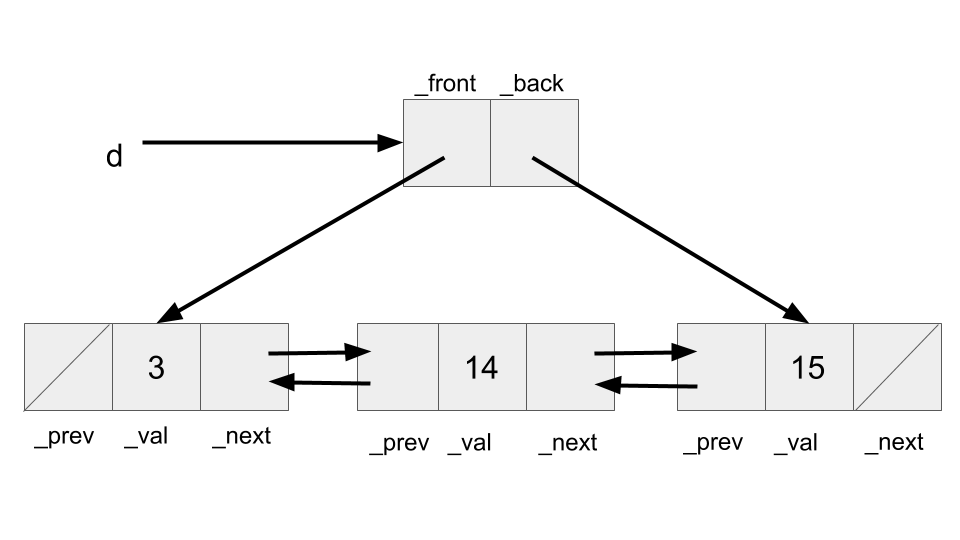

# Lab 5

Lab spec: [https://inst.eecs.berkeley.edu/\~cs61b/sp22/materials/lab/lab5/index.html](https://inst.eecs.berkeley.edu/\~cs61b/sp22/materials/lab/lab5/index.html)

Welcome to lab 5! I won't be covering Object Oriented Programming or the hierarchical structure of the Java Standard Library in this guide. Instead, I'll be focusing on Iterators and the Iterable interface.

If you're wondering where lab 4 went, there was no lab 4 assignment! The section was converted to project office hours.

## Iterables and Iterators

A lot of students get confused between `Iterable`s and `Iterator`s when first seeing them -- I know I was confused too. Let me use an analogy:



Here we have a vase and a hammer. From real world experience, we know that vases are quite fragile -- a property which I will call **Breakable**. Vases aren't the only Breakable objects, and plates, glass cups, and eggs could all be considered Breakable.

On the other hand, a hammer is an object that breaks Breakable objects. We could call such an object a **Breaker**. Breakers could also include sledgehammers or wrecking balls.

We observe the relationship between these two types as: Breaker objects break Breakable objects. Similarly, `Iterator` objects iterate over `Iterable` objects.&#x20;

## TableFilter

Before you can complete this section, it's _crucially important_ that you understand how to read and understand skeleton code. The lab spec will help you greatly in figuring out what each method does -- it's your job to figure out which methods are relevant to whatever you're doing.

For the following filters that you're asked to complete, you'll find that they are all extremely similar. I   would recommend starting out with the `ColumnMatchFilter`, as it will teach you the most. **At this point, I recommend you go and try to figure out the answer by yourself.** I will provide hints in increasing level of specificity, but you will learn a lot more if you figure it out yourself. If you get stuck, feel free to come back and look at a tip or two before moving on.

<details>

<summary>I have no idea what to do</summary>

Let's work backwards. We need to fill in the `keep()` method so that it keeps only the rows that match our criteria. In doing so, we need to:

1. Get the values of interest from the `Table`(where should this happen?)
2. Somehow get those values into `keep()`
3. Make comparisons to determine whether or not the `TableRow` should be kept

</details>

<details>

<summary>What exactly does <code>keep()</code> do, anyway?</summary>

Many students have a misconception that the `keep()` method will apply to the entire table and try to use `for` or `while` loops. _Stop!_ You don't need to use any loops while doing this assignment. Take note of the return type of `keep()`: boolean. `keep()` decides, _for a given `TableRow`_, if it should be kept or filtered out. How it gets that particular `TableRow` is of no concern and is **abstracted** away.

</details>

<details>

<summary>How do I get values of interest into <code>keep()</code>?</summary>

Consider using instance variables :)

</details>

<details>

<summary>How do I get the next <code>TableRow</code> / I'm getting the <code>TableRow</code> correctly but can't seem to access it twice?</summary>

Look at `TableFilter.java` -- is there a method that returns a `TableRow`, and more specifically the next `TableRow` that we want? Using this method over a `next()` call will also ensure that we don't advance the iterator when we don't want to.

</details>

## JoinIterator

Many students are confused about what exactly this `JoinIterator` is doing. The `JoinIterator` actually consists of two iterators, one for each table, and is constructing the joined table. You can see an example below.

.png>)

For extra programming help, take a look at the `JoinIterator` constructor.


```java
private JoinIterator(Table t1, Table t2) {
    _table2 = t2;
    _tableIter1 = t1.iterator();
    _tableIter2 = t2.iterator();
    _currRow1 = _tableIter1.next();
}
```


Why did the skeleton code include these specific variables as instance variables? Why was `_table2` included, but not `_table1`? Is it possibly, to _construct a new iterator when necessary?_ This then begs the question, when do we need to create a new iterator? As a final question, how do we know when we are done iterating through both tables?

Answering these questions will put you well on the path to completing this assignment. While doing so, remember that `hasNext()` is concerned only with whether there is a next row to iterate over, or not.
